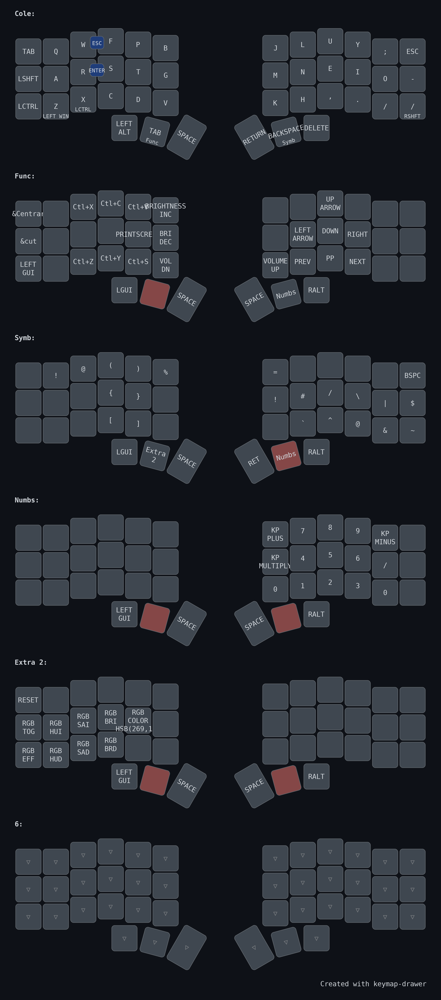

# ⌨️ ZMK Config - Corne Keyboard (Colemak + Nice!OLED Edition)

Este es mi repositorio personal de configuración para ZMK, diseñado para un teclado dividido **Corne**.  
Incluye soporte para **pantallas OLED funcionales en ambos lados**, uso de **modtap**, dos **macros útiles en After Effects**, y **RGB underglow** con efecto personalizado.  
Utilizo esta distribución para **uso cotidiano, programación y diseño profesional** en herramientas como **Blender**, **Maya** y **After Effects**.

---

## 📷 Vista de la distribución

  
🔗 [Ver versión vectorial SVG](assets/my_keymap.svg)

---

## 🧩 Hardware utilizado

- **Teclado:** Corne
- **MCU:** ProMicro NRF52840
- **Pantallas OLED:** Nice!OLED activas en ambos lados
- **RGB Underglow:** Activado con efecto Swirl
- **Distribución base:** Colemak (no DH)
- **Bluetooth:** Potencia TX mejorada

---

## 🎛️ Configuración destacada

### 🖥️ Pantalla OLED
- `CONFIG_ZMK_DISPLAY=y`
- `CONFIG_ZMK_DISPLAY_STATUS_SCREEN_CUSTOM=y`
- Widgets activos:
  - Estado de capa (`layer status`)
  - Estado de batería
  - Conexión (BLE/USB)
  - WPM
  - Luna (animación activada)

### 🔘 Modtap
Teclas que actúan como modificador si se mantienen, o como carácter si se tocan rápido:
```dts
&mt LCTRL A     // A normal, Ctrl si se mantiene
&mt LALT SPACE  // Espacio normal, Alt si se mantiene
```
Parámetros clave:
```conf
CONFIG_ZMK_HOLD_TAP_DELAY_MS=200
CONFIG_ZMK_HOLD_TAP_PER_KEY=y
```

### 🔀 Combos

| Combo        | Teclas       | Resultado |
|--------------|--------------|-----------|
| `ESC`        | W + F        | Escape    |
| `Enter`      | R + S        | Enter     |

---

## 🪄 Macros personalizadas (After Effects)

### 🎯 Centrar texto
```plaintext
Ctrl + Alt + Shift + Home
```

### ✂️ Cortar capa
```plaintext
Ctrl + Shift + D
```

Ambas están activadas desde teclas dedicadas como macros ZMK.

---

## 🌈 RGB Underglow
- Activado:
  ```conf
  CONFIG_ZMK_RGB_UNDERGLOW=y
  ```
- Efecto:
  ```conf
  CONFIG_ZMK_RGB_UNDERGLOW_EFF_START=3  // Swirl
  ```
- Color inicial:
  ```conf
  CONFIG_ZMK_RGB_UNDERGLOW_HUE_START=240
  CONFIG_ZMK_RGB_UNDERGLOW_SAT_START=10
  CONFIG_ZMK_RGB_UNDERGLOW_BRT_START=15
  ```

---

## ⌨️ Capas (Layers)

### 🔡 Capa alfabética
- Basada en **Colemak** normal
- Home row mods activos en ambas manos
- Teclas de navegación en posiciones ergonómicas

### 🔣 Capa de símbolos
- Inspirada en Pascal Getreuer
- Mirror para `{}`, `()`, `[]`
- Home row mods activos

### 🔢 Capa miscelánea
- Números en la derecha simulando numpad
- Flechas colocadas en home row
- Acentos frecuentes en español/francés
- Home row mods solo en derecha

### 🎚️ Capa de funciones
- Por implementar: F1–F12
- F13/F14 reservados para Discord (Mute/Deafen)
- Soporte para gestión de perfiles Bluetooth
- Home row mods desactivados aquí para mejorar acceso rápido

---

## 🛠️ Cómo compilar tu firmware ZMK

### 📡 Opción 1: GitHub Actions (RECOMENDADO)
1. Clona este repositorio:  
   👉 [`https://github.com/St33pFx/zmk-config`](https://github.com/St33pFx/zmk-config)

2. Ejecuta el instalador:
```bash
bash -c "$(curl -fsSL https://zmk.dev/setup.sh)"
```

3. Sigue el asistente:
   - Teclado: Corne
   - MCU: ProMicro NRF52840
   - Configuración: Selecciona este repo

4. Accede a la pestaña "Actions" y descarga los `.uf2` generados.

5. Flashea en tu teclado (modo bootloader).

### 💻 Opción 2: Compilación local
```bash
git clone https://github.com/zmkfirmware/zmk
git clone https://github.com/St33pFx/zmk-config
cd zmk-config

# Compilar lado izquierdo
west build -s zmk/app -d build/left -b nice_nano -- -DSHIELD=corne_left

# Compilar lado derecho
west build -s zmk/app -d build/right -b nice_nano -- -DSHIELD=corne_right
```

---

## 📶 Conexión Bluetooth

- El lado izquierdo es el maestro por defecto
- Emparejamiento BLE activo por ZMK
- Permite múltiples perfiles BLE
- Combinaciones configurables para cambiar perfiles

---

## 🔧 Extras técnicos

- `CONFIG_BT_CTLR_TX_PWR_PLUS_8=y`: Mayor potencia BT
- `CONFIG_ZMK_BLE_EXPERIMENTAL_CONN=y`: Mejor conexión con Windows/iPad
- `CONFIG_ZMK_KSCAN_DEBOUNCE_PRESS_MS=1`: Menor latencia de tecleo

---

## 🧼 Problemas resueltos

- ❌ Error `multiple definition 'widget_layer_status'`
  ✅ Solucionado sin desactivar pantallas (ambas OLED están activas)

---

## ✍️ Autor

**Yahir Salazar**  
Junio 2025  
[github.com/St33pFx](https://github.com/St33pFx/zmk-config)

---

## ❤️ Agradecimientos

- Comunidad ZMK  
- Nick Coutsos (keymap visual editor)  
- M. Zeglinski (fork OLED funcional)  
- Contributors de QMK/ZMK  
- Usuarios de ZMK Discord por el soporte técnico

---

## 🔗 Recursos adicionales

- Página oficial de ZMK: [https://zmk.dev](https://zmk.dev)
- Editor visual de layout: [keymap-editor](https://nickcoutsos.github.io/keymap-editor/)
- Repositorio: [https://github.com/St33pFx/zmk-config](https://github.com/St33pFx/zmk-config)